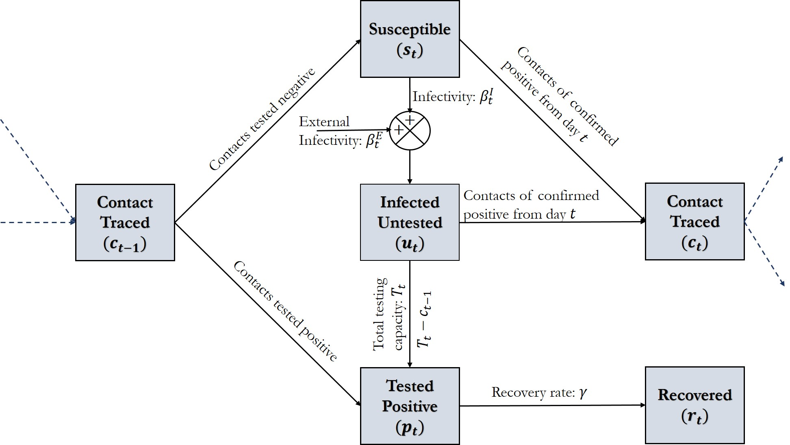
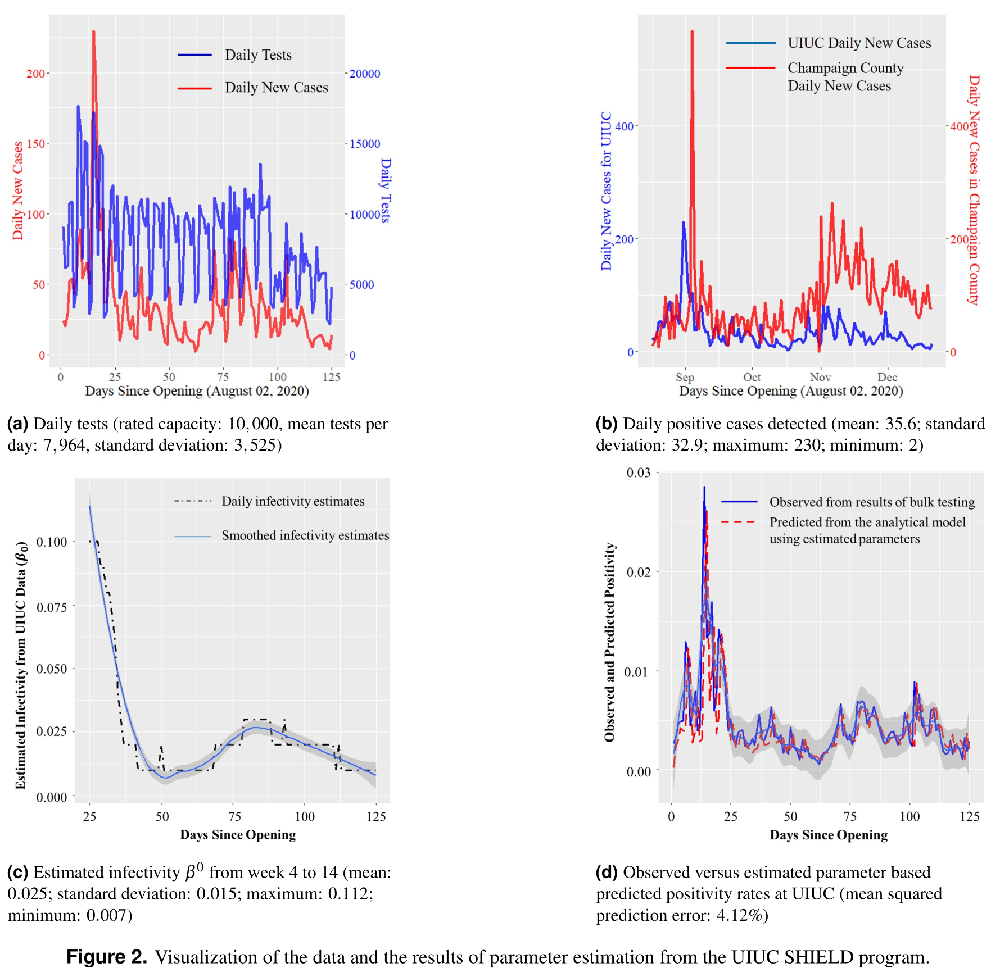
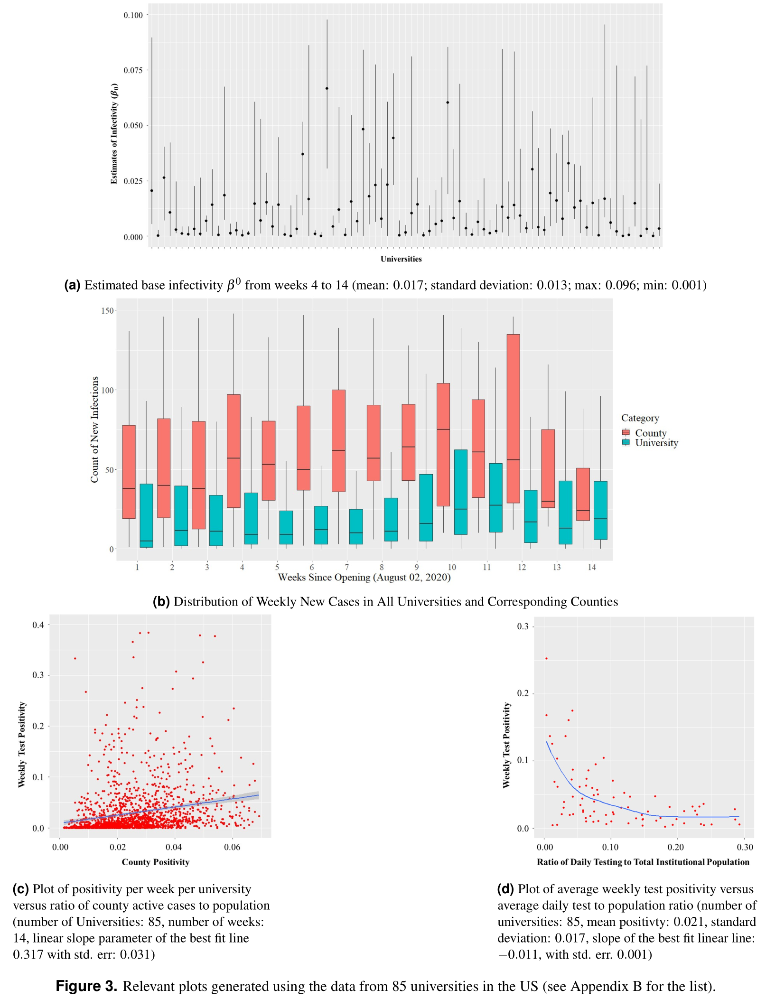
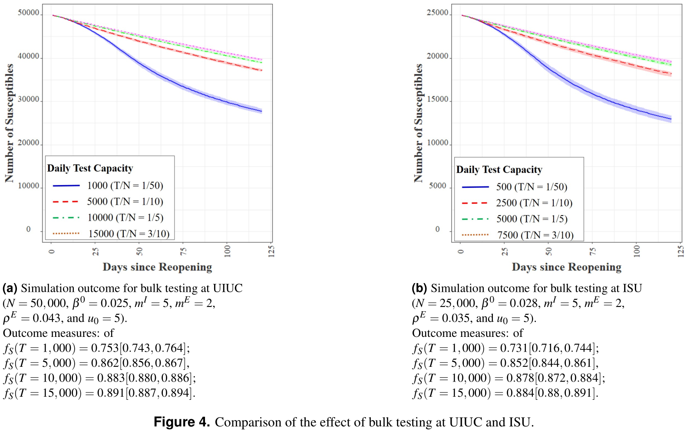
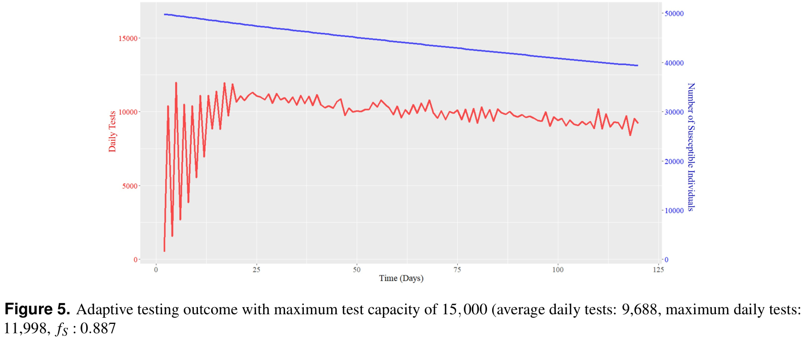
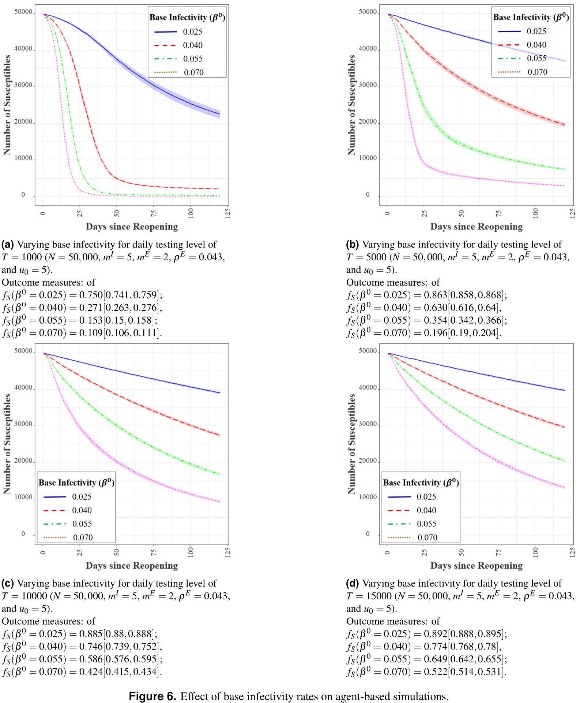
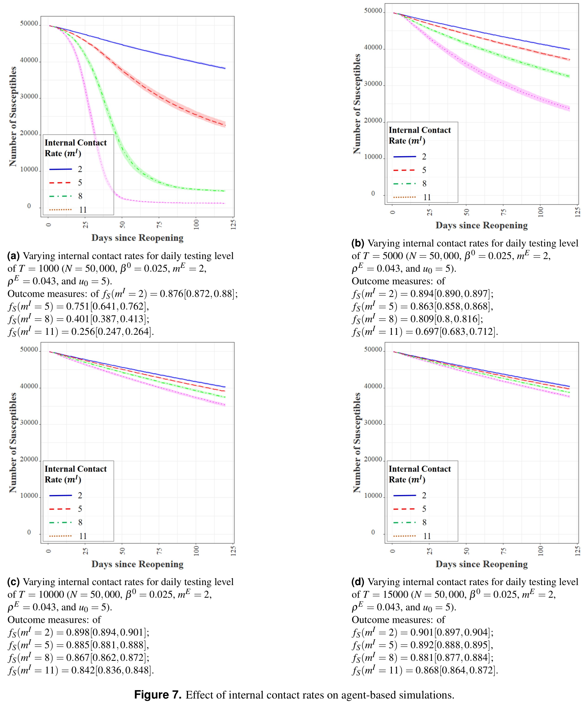

## Safe Reopening Strategies For Educational Institutions During COVID-19: A Data-Driven Agent-Based Approach

Many educational institutions have partially or fully closed all operations to cope with the challenges of the ongoing COVID-19 pandemic. In this paper, we explore strategies that such institutions can adopt to conduct safe reopening and resume operations during the pandemic. The research is motivated by the University of Illinois at Urbana-Champaign’s (UIUC’s) SHIELD program, (https://www.uillinois.edu/shield), which is a set of policies and strategies, including rapid saliva-based COVID-19 screening, for ensuring safety of students, faculty and staff to conduct in-person operations, at least partially. Specifically, we study how rapid bulk testing, contact tracing and preventative measures such as mask wearing, sanitization, and enforcement of social distancing can allow institutions to manage the epidemic spread.

Download [paper](https://www.medrxiv.org/content/10.1101/2020.09.04.20188680v5).

**Figure 1.** The SUPR Infection Dynamics with Testing and Contact Tracing (where, *st*: number of susceptible individuals, *ut*: number of undetected infected individuals, *pt*: number of positive infections detected from testing, *rt*: number of recovered individuals, *ct* number of contacts traced on date *t*, *Tt*: total number of tests, *βtI*: internal infectivity, *βtE: external infectivity, and *γ*: recovery rate.)

